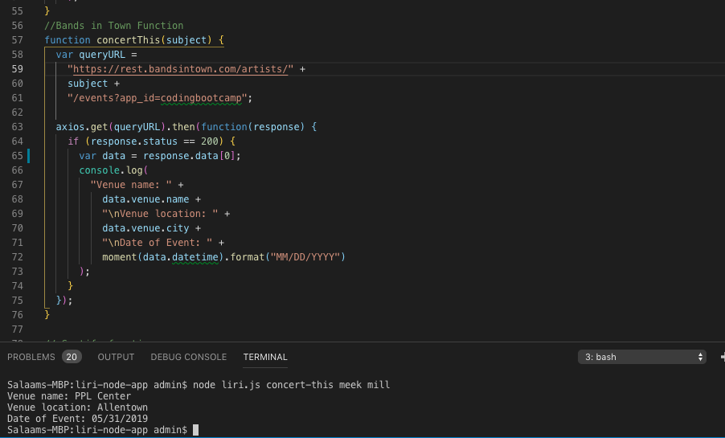
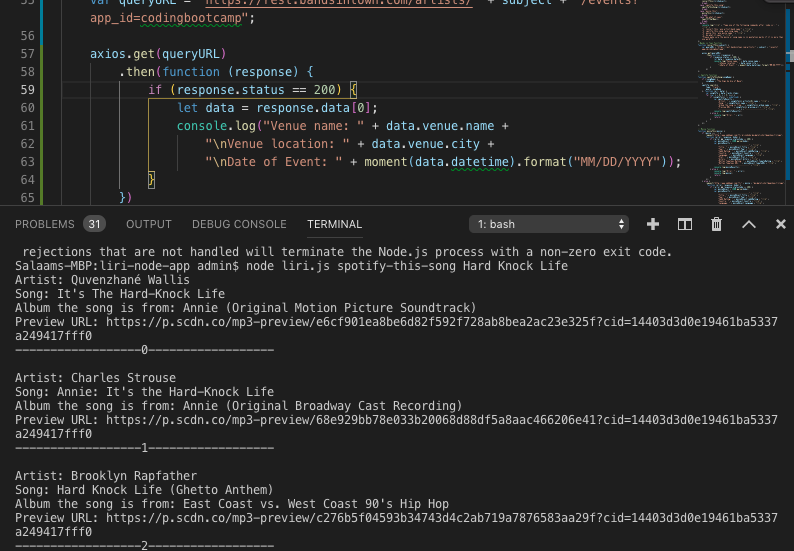
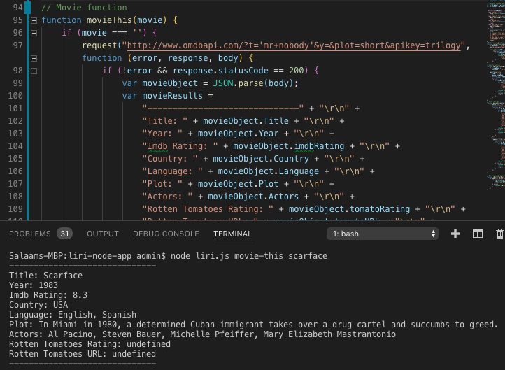
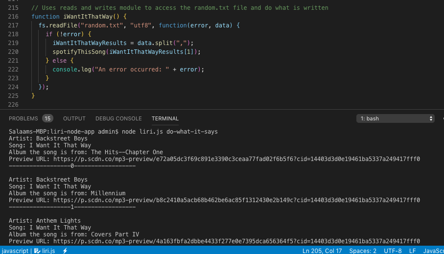

# liri-node-app

Summary
LIRI will search Spotify for songs, Bands in Town for concerts, and OMDB for movies. LIRI is like iPhone's SIRI. However, while SIRI is a Speech Interpretation and Recognition Interface, LIRI is a Language Interpretation and Recognition Interface. LIRI is a command line node app that takes in parameters and gives you back data.

Languages Used
This application uses Node.js, moment, axios and request, and JavaScript.

Introduction
To begin, the application gives you the option to choose between "concert-this", "spotify-this-song", "movie-this, or "do-what-it-says".

Concert-This
Looking to see if your favorite artist has any upcoming shows. Type in the name of the artist and a display of venue name, location, and date will be provided.

Spotify-This-Song
Song stuck in your head, but you just can't remember who sang it? Type in your song title and spotify-this will provide you with five of the most relative answers to your jam. It will include the artist's name, song title, album, and a preview URL.

Movie-This
What was that actor's name - you know, the one who starred in that movie? If you need to settle a bet with your friend on whether or not Denzel Washington was the star of your favorite film, along with other useful information movie-this has got you covered.

Do-What-It-Says
If you feel like being told what to do, try using the do-what-it-says command to see what it comes up with.

